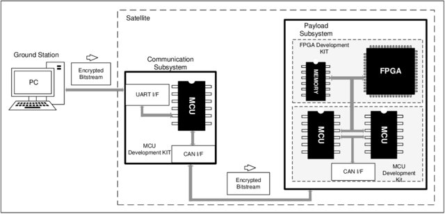

# A Module for Remote Reconfiguration of FPGAs in Satellites

## Overview
This repository presents the code of the implementation of an embedded system module to allow the reconfiguration of an FPGA integrating the payload of a satellite. This design applies Warm Standby Spare redundancy and AES cryptography algorithm to increase its lifetime and protect the FPGA bitstream. The proposed module and system was prototyped with PIC18F family and Intel Cyclone IV FPGA.

## General Diagram

Fig: Block diagram of the proposed prototype system with modules.

## Repository Organization
	- Ground station: source code to simulate the gound station that send the bitstream.
	- Communication subsystem: source code to emulate the communication subsytem with CAN protocol.
	- Payload subsystem: source code of FPGA reconfiguration subsystem with cryptography, CAN protocol warm standby spare fault tolerant technique.

## Prerequisites

- [Intel Quartus Prime](https://www.intel.com.br/content/www/br/pt/products/details/fpga/development-tools/quartus-prime.html)
- [Qt Creator](https://www.qt.io/product/development-tools)
- [Microchip MPLAB 8](https://www.microchip.com/en-us/tools-resources/archives/mplab-ecosystem)
- [CCS Compiler](https://www.ccsinfo.com/compilers.php)
- [Microchip PICDEM CAN-LIN 3](https://www.microchip.com/en-us/development-tool/dm163011)
- [Microchip MPLAB ICD 3](https://www.microchip.com/en-us/development-tool/dv164035)
- [Kit CoreEP4CE6](https://www.waveshare.com/coreep4ce6.htm)
- [Optional - Logic Converter TXS0108E](https://www.ti.com/product/TXS0108E?utm_source=google&utm_medium=cpc&utm_campaign=asc-null-null-GPN_EN-cpc-pf-google-wwe&utm_content=TXS0108E&ds_k=TXS0108E&DCM=yes&gclid=CjwKCAjw8ZKmBhArEiwAspcJ7jIn69olMPhTf3WOoCju4DAXBMs7yFpxmuKkwnineteVaKQasplu3xoCsWAQAvD_BwE&gclsrc=aw.ds)

## Citation

If you use this code in your research, we would appreciate a citation to the original paper and final course assignment:

	@inproceedings{viel2017module,
      title={A Module for Remote Reconfiguration of FPGAs in Satellites},
      author={Viel, Felipe and Zeferino, Cesar Albenes},
      booktitle={IBERCHIP workshop},
      pages={50--53},
      year={2017}
      }
   @mastersthesis{viel2016module,
	   address={Itajaí, SC, Brasil},
	   author="Felipe Viel",
	   pages="118",
	   school="Universidade do Vale do Itajaí",
	   publisher="Bacharelado em Engenharia de Computação",
	   title="Desenvolvimento de módulo de reconfiguração remota de FPGA para ambiente espacial",
	   type={Bachelor's Thesis},
      url="https://siaibib01.univali.br/pdf/Felipe%20Viel%202017.pdf"
	   year="2016"
	   } 

## Acknowledgement

Software base used and modified to PIC18F microcontroller is from SRunner EPCS software driver by [Intel FPGA](https://www.intel.com/content/www/us/en/support/programmable/support-resources/configuration/cfg-solutions.html).
   
## License

Copyright (c) 2023 Felipe Viel. Released under the MIT License. See [LICENSE](LICENSE) for details.
